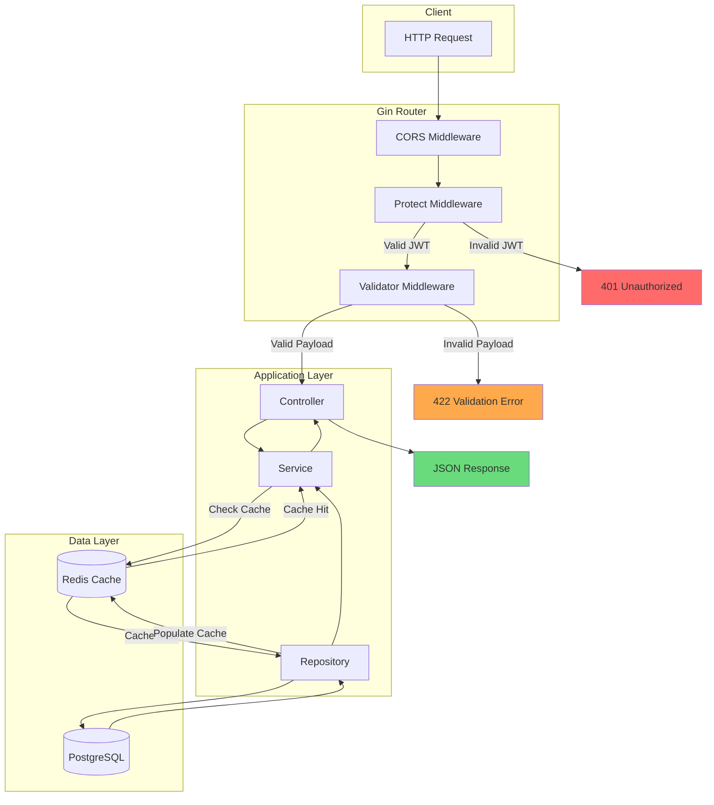
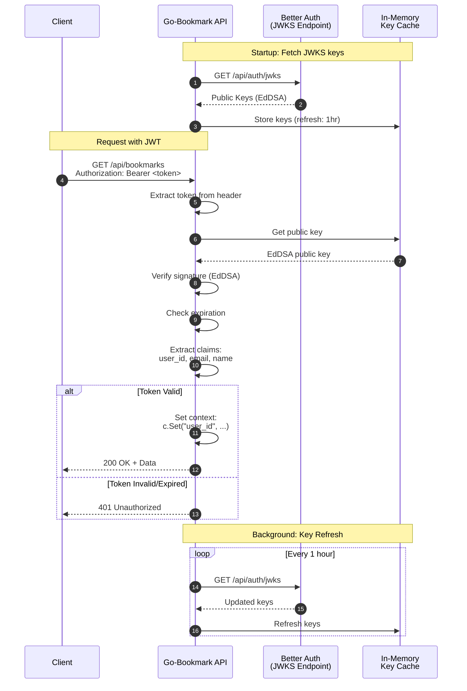
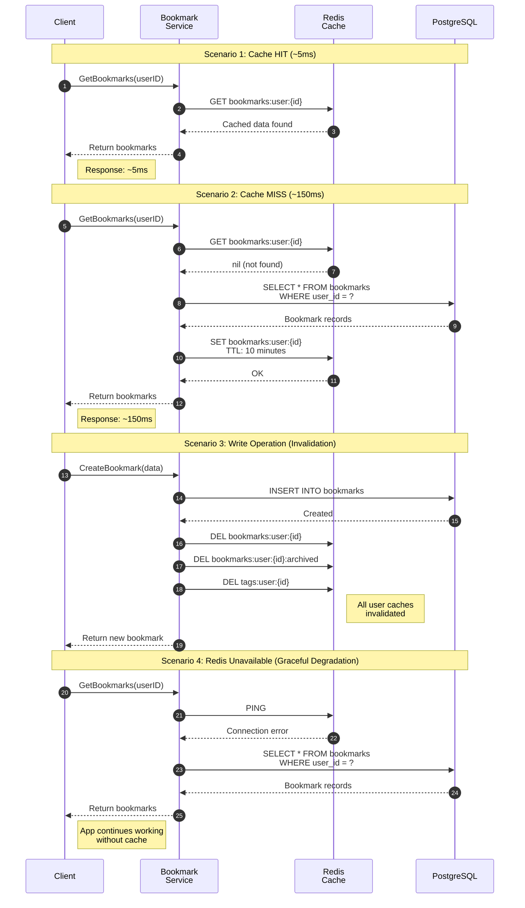
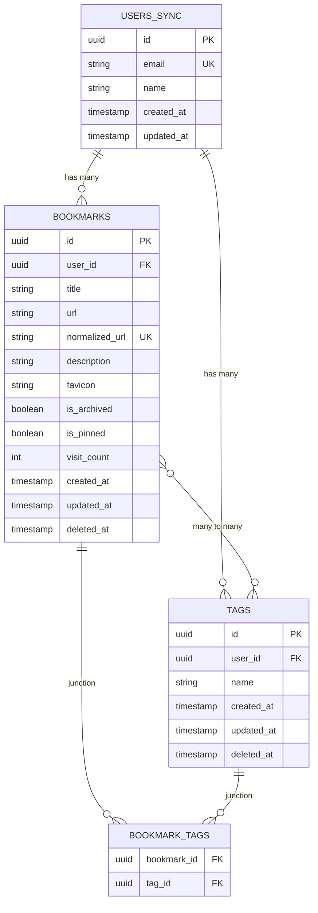
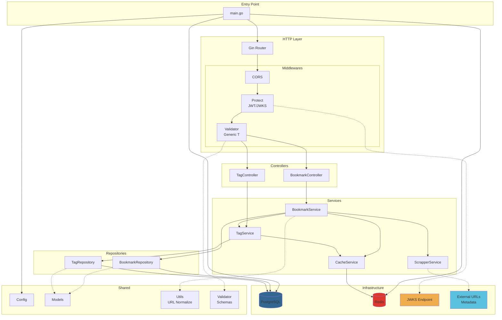
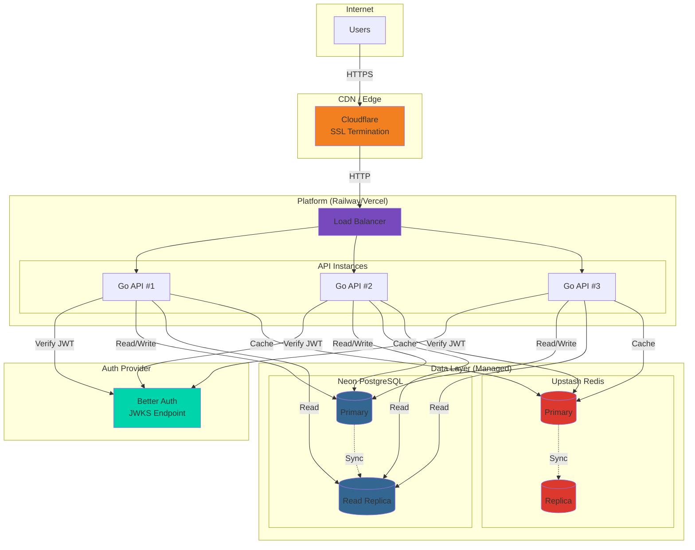
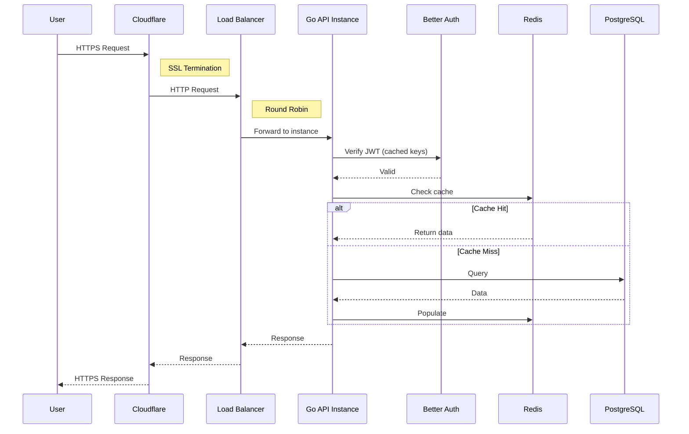

# Diagramas de Arquitectura: Go-Bookmark API

> Estos diagramas complementan el documento [04-system-design.md](./04-system-design.md)
> Formato: Mermaid (compatible con GitHub, Notion, Obsidian, etc.)

---

## Tabla de Contenidos

1. [Request Lifecycle](#1-request-lifecycle)
2. [Authentication Flow (JWKS)](#2-authentication-flow-jwks)
3. [Cache Flow (Hit vs Miss)](#3-cache-flow-hit-vs-miss)
4. [Entity Relationship Diagram](#4-entity-relationship-diagram-erd)
5. [Component Diagram](#5-component-diagram)
6. [Deployment Architecture](#6-deployment-architecture)

---

## 1. Request Lifecycle

Flujo completo desde que llega un request HTTP hasta la respuesta.



---

## 2. Authentication Flow (JWKS)

Como funciona la autenticacion con JWKS y JWT EdDSA.



---

## 3. Cache Flow (Hit vs Miss)

Patron Cache-Aside con tiempos de respuesta.



---

## 4. Entity Relationship Diagram (ERD)

Modelo de datos con relaciones y constraints.



### Notas del ERD

| Tabla | Schema | Notas |
|-------|--------|-------|
| `users_sync` | `neon_auth` | Externa, gestionada por Better Auth |
| `bookmarks` | `public` | Soft delete via `deleted_at` |
| `tags` | `public` | User-scoped (cada usuario tiene sus propios tags) |
| `bookmark_tags` | `public` | Join table para N:M |

### Indices

```sql
-- Evita duplicados de URL por usuario
CREATE UNIQUE INDEX idx_user_url ON bookmarks(user_id, normalized_url);

-- Busqueda rapida por usuario
CREATE INDEX idx_bookmarks_user_id ON bookmarks(user_id);
CREATE INDEX idx_tags_user_id ON tags(user_id);

-- Ordenamiento por fecha
CREATE INDEX idx_bookmarks_created_at ON bookmarks(created_at);
```

---

## 5. Component Diagram

Estructura de componentes internos y sus dependencias.



### Leyenda

| Color | Significado |
|-------|-------------|
| Azul | PostgreSQL (persistencia) |
| Rojo | Redis (cache) |
| Amarillo | Servicio externo autenticacion |
| Celeste | Servicios externos web |
| Linea punteada | Dependencia opcional/config |

---

## 6. Deployment Architecture

Arquitectura de despliegue en produccion.



### Flujo de Datos en Produccion



### Caracteristicas de Produccion

| Componente | Servicio | Caracteristica |
|------------|----------|----------------|
| **SSL** | Cloudflare | Termination en edge, certificados automaticos |
| **Load Balancer** | Railway | Round Robin, health checks |
| **API** | Railway | Auto-scaling, zero-downtime deploys |
| **Auth** | Better Auth | JWKS con rotacion automatica |
| **Database** | Neon | Connection pooling, read replicas |
| **Cache** | Upstash | Serverless Redis, global replication |

---

## Como Usar Estos Diagramas

### En GitHub

Los archivos `.md` con bloques de codigo Mermaid se renderizan automaticamente.

### En Notion

1. Crear bloque de codigo
2. Seleccionar lenguaje "Mermaid"
3. Pegar el codigo

### En Presentaciones

Usar [Mermaid Live Editor](https://mermaid.live/) para exportar como:
- PNG (alta resolucion)
- SVG (vectorial)

### En Portfolio Web

```jsx
// Con react-mermaid o similar
import Mermaid from 'react-mermaid';

<Mermaid chart={`
  flowchart TB
    A --> B
`} />
```

---

## Herramientas Alternativas

Si prefieres diagramas mas visuales:

| Herramienta | Uso | Link |
|-------------|-----|------|
| **Excalidraw** | Diagramas hand-drawn style | [excalidraw.com](https://excalidraw.com) |
| **draw.io** | Diagramas profesionales | [draw.io](https://draw.io) |
| **Figma** | Diseno personalizado | [figma.com](https://figma.com) |
| **Lucidchart** | Diagramas colaborativos | [lucidchart.com](https://lucidchart.com) |

---

> Estos diagramas complementan la documentacion tecnica y son ideales para presentaciones de portfolio o entrevistas tecnicas.
